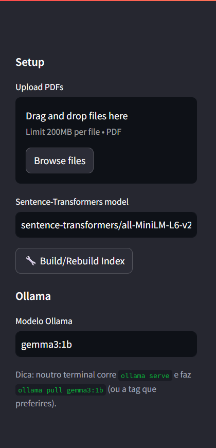
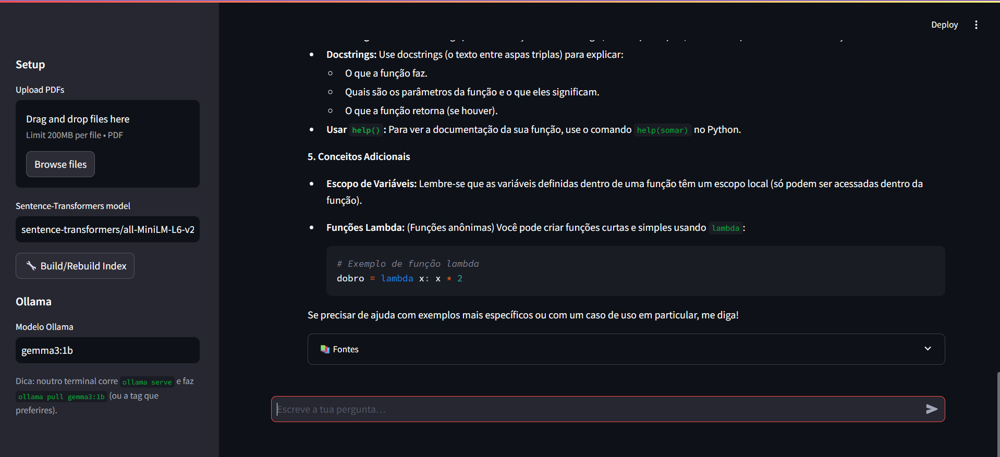

# 📄 Chat com Documentos (RAG)

Um projeto de **Chat com PDFs** usando **RAG (Retrieval-Augmented
Generation)**, construído com:

-   [Streamlit](https://streamlit.io) → interface web simples e rápida\
-   [FAISS](https://github.com/facebookresearch/faiss) → motor de busca
    vetorial\
-   [Sentence-Transformers](https://www.sbert.net) → embeddings
    semânticos\
-   [Ollama](https://ollama.ai) → LLM local (ex.: `gemma3:1b`,
    `mistral:7b-instruct`, `llama3.1:8b-instruct`)\
-   [PyPDF](https://pypi.org/project/pypdf/) → extração de texto de PDFs

------------------------------------------------------------------------

## 🚀 Funcionalidades

-   Upload de **PDFs** pela interface ou colocar manualmente em
    `./pdfs`\
-   Extração de texto, divisão em *chunks* e criação de **índice
    vetorial** (FAISS)\
-   Pesquisa semântica nos documentos e **respostas citadas** no chat\
-   Integração com modelos **Ollama** (funciona 100% local, sem depender
    da cloud)\
-   Controle no sidebar para reconstruir índice e escolher o modelo LLM

------------------------------------------------------------------------

## 📦 Instalação

### 1. Clonar o repositório

``` bash
git clone https://github.com/joaoacabouz/RagPDF.git
cd RagPDF
```

### 2. Criar ambiente virtual

No Windows (PowerShell):

``` powershell
python -3.11 -m venv .venv
.venv\Scripts\activate
```

No Linux/macOS:

``` bash
python3 -m venv .venv
source .venv/bin/activate
```

### 3. Instalar dependências

``` bash
pip install -r requirements.txt
```

------------------------------------------------------------------------

## ⚙️ Uso

### 1. Arrancar o Ollama

Instala o [Ollama](https://ollama.ai/download) e inicia o serviço:

``` bash
ollama serve
```

Faz *pull* de um modelo (exemplo: Gemma 3 1B):

``` bash
ollama pull gemma3:1b
```

### 2. Executar a aplicação

``` bash
streamlit run app.py
```

### 3. Fluxo na interface

1.  Upload de PDFs pelo sidebar (ou colocar ficheiros em `./pdfs`)\
2.  Clicar em **Build/Rebuild Index** para criar o índice FAISS\
3.  Escrever perguntas no chat → respostas aparecem com **citações
    \[1\], \[2\]** que apontam para os PDFs/páginas

------------------------------------------------------------------------

## 📂 Estrutura do Projeto

    .
    ├── app.py              # Código principal Streamlit
    ├── requirements.txt    # Dependências
    ├── pdfs/               # Colocar aqui os PDFs
    └── vectorstore/        # Índice vetorial gerado automaticamente

------------------------------------------------------------------------

## 🖼️ Screenshots

### Upload de PDFs



### Chat com respostas citadas



------------------------------------------------------------------------

## 🔮 Melhorias Futuras

-   Suporte a mais formatos (DOCX, TXT, Markdown)\
-   Modo misto: responder só com PDFs 🔒 ou também com conhecimento do
    LLM 🌐\
-   Persistência do histórico de chat em ficheiro\
-   Deploy fácil em Docker ou Hugging Face Spaces

------------------------------------------------------------------------

## 📜 Licença

Este projeto é apenas para **uso educacional e de portfólio**.\
Sente-te à vontade para adaptar e melhorar.
